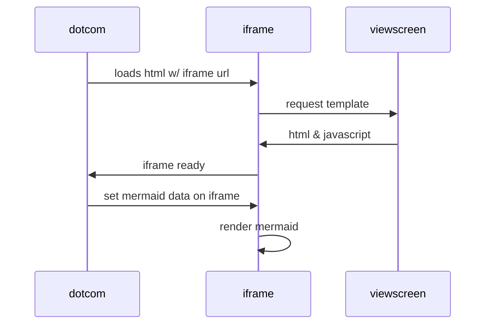

# Denotarius.io backend service

Denotarius is a simple service that is record some data on-chain forever. A simple notary. The user sends a list of documents, is prompter to pay, after paying this is recorded on chain.

